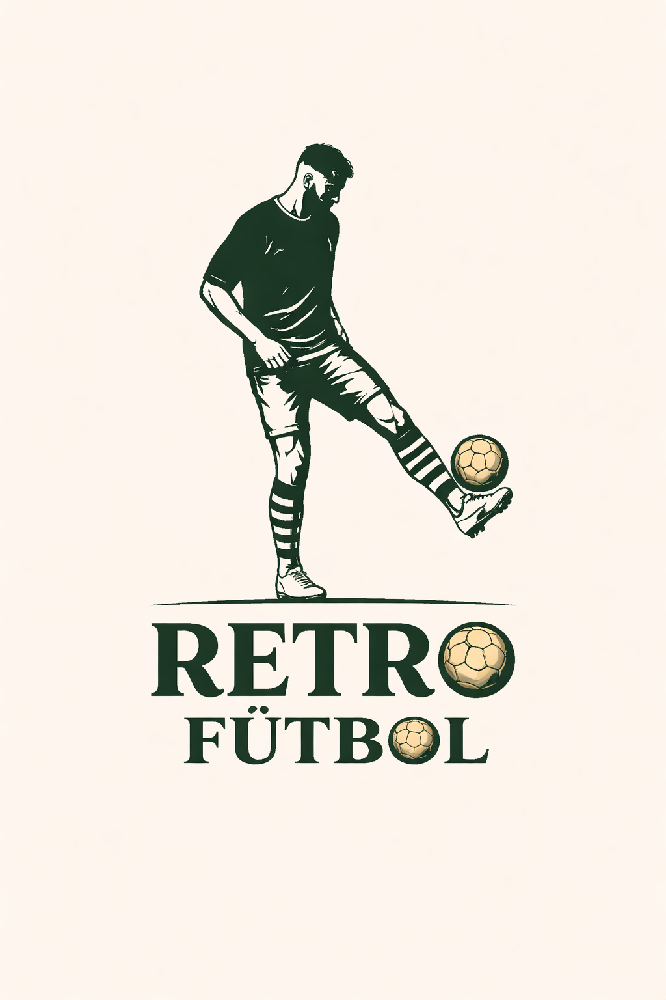

# ⚽ RetroFútbol

> La tienda de referencia en camisetas de fútbol retro. Más de 200 camisetas auténticas de los mejores equipos y selecciones de la historia.



---

## 🌐 Demo en producción

| | URL |
|---|---|
| 🖥️ Frontend | [retrofutbol.vercel.app](https://retrofutbol.vercel.app) |
| ⚙️ Backend API | [retrofutbol-api.onrender.com](https://retrofutbol-api.onrender.com) |

---

## 📖 Descripción del proyecto

**RetroFútbol** es un e-commerce fullstack especializado en camisetas de fútbol retro de las mejores ligas y selecciones del mundo: La Liga, Premier League, Serie A, Bundesliga y selecciones nacionales.

El proyecto nació de la pasión por el fútbol y la nostalgia por las camisetas icónicas que marcaron generaciones. Desde la camiseta del Barcelona 98-99 de Ronaldinho hasta la Nigeria del 96, cada prenda tiene una historia.

### ¿Por qué RetroFútbol?

- 🎯 **Público objetivo**: Aficionados al fútbol de 20-45 años con nostalgia por el fútbol de los 90 y 2000
- 🏆 **Propuesta de valor**: Réplicas de alta calidad con personalización de dorsal y nombre
- 💼 **Modelo de negocio**: Tienda online con gestión de stock, pedidos y panel de administración

---

## ✨ Funcionalidades

### 👤 Usuario
- ✅ Registro e inicio de sesión con JWT
- ✅ Perfil editable (nombre, apellidos, ciudad, teléfono)
- ✅ Carrito persistente **por usuario** (cada cuenta tiene su propio carrito)
- ✅ **Personalizador de camisetas**: talla, nombre dorsal, número y parches (+5€)
- ✅ Checkout con dirección y método de pago
- ✅ Historial de pedidos con estado en tiempo real
- ✅ Cierre de sesión desde el perfil y la navbar

### 🛍️ Tienda
- ✅ Catálogo con filtros por liga, equipo, precio y búsqueda en tiempo real
- ✅ Página de equipo con hero de pantalla completa y fondo dividido
- ✅ Detalle de producto con zoom de imagen
- ✅ Productos relacionados del mismo equipo
- ✅ Envío gratis a partir de 75€
- ✅ Sección "Encuéntranos" con Google Maps integrado

### 👑 Administrador
- ✅ Dashboard con estadísticas (productos, pedidos, usuarios, ingresos)
- ✅ CRUD completo de productos con subida de imágenes a Cloudinary
- ✅ Gestión de pedidos con cambio de estado
- ✅ Gestión de usuarios

---

## 🛠️ Stack tecnológico

### Backend
| Tecnología | Uso |
|---|---|
| **Node.js + Express** | Servidor REST API |
| **MongoDB + Mongoose** | Base de datos NoSQL |
| **JWT + bcryptjs** | Autenticación y seguridad |
| **Cloudinary + Multer** | Subida y gestión de imágenes |
| **csv-parser + fs** | Lectura de CSV para seeds |

### Frontend
| Tecnología | Uso |
|---|---|
| **React 19 + Vite** | Framework UI con bundler rápido |
| **React Router DOM** | Navegación y rutas protegidas |
| **Styled Components** | CSS-in-JS con variables globales |
| **React Hook Form** | Formularios con validación |
| **Axios** | Cliente HTTP con interceptores |
| **React Hot Toast** | Notificaciones |

### Infraestructura
| Servicio | Uso |
|---|---|
| **MongoDB Atlas** | Base de datos en la nube |
| **Cloudinary** | CDN de imágenes |
| **Render** | Despliegue del backend |
| **Vercel** | Despliegue del frontend |

---

## 🗄️ Modelo de datos

El proyecto cuenta con **3 colecciones** relacionadas entre sí, generadas a partir de archivos CSV:

```
Users (30 documentos)
├── name, lastname, email, password (bcrypt)
├── role: "admin" | "user"
└── city, phone

Products (72 documentos)
├── name, description, price
├── category (liga), brand (equipo)
├── temporada, talla, color, gender
├── stock, rating
└── image_url, cloudinary_id

Orders
├── user → ObjectId (ref: User)
├── items: [{ product → ObjectId (ref: Product), quantity, price }]
├── total, status
└── address, paymentMethod
```

---

## 🏗️ Arquitectura del proyecto

```
retrofutbol/
├── backend/
│   └── src/
│       ├── config/          # DB y Cloudinary
│       ├── controllers/     # Lógica de negocio
│       ├── middlewares/     # Auth y roles
│       ├── models/          # Schemas Mongoose
│       ├── routes/          # Endpoints REST
│       └── seeds/           # Datos iniciales desde CSV
└── frontend/
    └── src/
        ├── components/
        │   ├── layout/      # Navbar, Footer, Layout
        │   ├── ui/          # ProductCard, CartItem, Button...
        │   └── admin/       # ProductForm
        ├── context/         # AuthContext, CartContext
        ├── hooks/           # useFetch, useCart
        ├── pages/           # Todas las páginas
        ├── services/        # Llamadas a la API
        └── styles/          # GlobalStyles con variables CSS
```

---

## 🚀 Instalación local

### Requisitos
- Node.js 18+
- MongoDB Atlas account (o MongoDB local)
- Cloudinary account

### 1. Clonar el repositorio
```bash
git clone https://github.com/tuusuario/retrofutbol.git
cd retrofutbol
```

### 2. Configurar el backend
```bash
cd backend
npm install
```

Crea el archivo `.env`:
```env
MONGO_URI=mongodb+srv://...
JWT_SECRET=tu_jwt_secret
JWT_EXPIRES_IN=7d
CLOUDINARY_CLOUD_NAME=...
CLOUDINARY_API_KEY=...
CLOUDINARY_API_SECRET=...
PORT=5000
```

Poblar la base de datos:
```bash
npm run seed:products
npm run seed:users
```

Arrancar el servidor:
```bash
npm run dev   # http://localhost:5000
```

### 3. Configurar el frontend
```bash
cd frontend
npm install
```

Crea el archivo `.env`:
```env
VITE_API_URL=http://localhost:5000/api
```

Arrancar el frontend:
```bash
npm run dev   # http://localhost:5173
```

---

## 👥 Credenciales de prueba

| Rol | Email | Contraseña |
|---|---|---|
| 👑 Admin | maria1@email.com | password123 |
| 👤 Usuario | usuario1@email.com | password123 |

---

## 🔌 API Endpoints

### Auth
```
POST   /api/auth/register     Registro
POST   /api/auth/login        Login
GET    /api/auth/me           Perfil propio
PUT    /api/auth/me           Actualizar perfil
GET    /api/auth/users        Todos los usuarios (admin)
DELETE /api/auth/users/:id    Eliminar usuario (admin)
```

### Products
```
GET    /api/products          Listar con filtros
GET    /api/products/:id      Detalle
POST   /api/products          Crear (admin)
PUT    /api/products/:id      Editar (admin)
DELETE /api/products/:id      Eliminar (admin)
```

### Orders
```
POST   /api/orders            Crear pedido
GET    /api/orders/my-orders  Mis pedidos
GET    /api/orders/:id        Detalle pedido
GET    /api/orders            Todos (admin)
PUT    /api/orders/:id/status Cambiar estado (admin)
```

---

## 🎨 Decisiones de diseño

- **Paleta de colores**: Verde oscuro `#2d4a2d` como color principal, dorado `#c9a84c` como acento, crema `#f5f0e8` como fondo — evoca los estadios, el césped y los trofeos
- **Variables CSS globales**: Todos los colores, espaciados, radios y sombras definidos en `GlobalStyles.js` para coherencia total
- **Carrito por usuario**: Cada usuario tiene su propio carrito en localStorage con clave `cart_USERID`, evitando mezclar cestas entre sesiones
- **Personalizador**: El precio sube +5€ automáticamente al añadir nombre o número, y se refleja en el carrito y en el pedido
- **TeamPage**: Hero a pantalla completa con fondo dividido en 2 fotos del equipo, creando un efecto visual potente

---

## 📱 Responsive

La aplicación está optimizada para:
- 🖥️ Desktop (1400px+)
- 💻 Laptop (1024px)
- 📱 Móvil (en progreso)

---

## 👨‍💻 Autor

**Marcos** — Proyecto final del Bootcamp Full Stack  
Hecho con ❤️ y pasión por el fútbol desde Puerto Real, Cádiz 🌊

---

*© 2026 RetroFútbol. Todos los derechos reservados.*